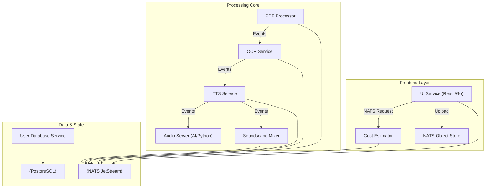

# Book Expert: The AI Audio Experience Platform

**Book Expert** is an enterprise-grade, event-driven platform that transforms static PDF documents into immersive, cinematic audio experiences. Unlike traditional Text-to-Speech (TTS) converters, Book Expert leverages a sophisticated microservices architecture to analyze content, generate emotive narration, and weave in dynamic soundscapes, creating a "movie for your ears."

## 🚀 Key Value Proposition

*   **Cinematic Immersion:** Goes beyond flat narration by integrating background music and sound effects tailored to the text's mood.
*   **Scalable Architecture:** Built on **NATS JetStream**, the system decouples processing stages (OCR, TTS, Mixing), allowing infinite horizontal scaling to handle heavy workloads.
*   **Pay-per-Job Model:** Precise cost estimation based on character count and selected enhancements ensures transparent, usage-based billing.
*   **Enterprise Security:** Self-hosted capabilities with strict data isolation using NATS Object Stores and PostgreSQL multi-tenancy.

---

## 🏗️ System Architecture

The platform is designed as a pipeline of specialized, autonomous microservices.

### Core Services

1.  **UI Service (BFF):** A robust Go backend serving a modern React/Vite frontend. Handles authentication, file uploads, and real-time status updates via the Bridge Service.
2.  **User Database Service:** The central source of truth for identity, authentication (Argon2id/JWT), and job state management, backed by PostgreSQL.
3.  **Cost Estimator:** A specialized worker that analyzes document density (character count) to provide precise, real-time pricing quotes.
4.  **PDF-to-PNG Service:** Renders PDF pages into high-quality images and uses Gemini to generate document-wide narration and music directives.
5.  **PNG-to-Text Service:** Uses Gemini-powered OCR to extract and normalize text, optimized for spoken narration (STEM expansion, code block handling).
6.  **TTS Service:** Orchestrates speech synthesis and music generation, managing workload distribution across GPU-accelerated workers.
7.  **Audio Server (Python):** A dedicated AI inference engine hosting state-of-the-art Voice Cloning models (VoxCPM 1.5).
8.  **Soundscape Service:** Generates tailored background music and ambient soundscapes using Google Lyria.
9.  **Audio Mixer Service:** Aggregates speech chunks, truncates silence, and mixes in background music to produce the final audio artifact.
10. **Bridge Service:** Synchronizes asynchronous backend events with the User Database Service to provide real-time status to the UI.
11. **NATS Orchestrator Service:** Provisions and manages the NATS JetStream infrastructure (Streams, Buckets, KV).

### Foundation & Tooling

*   **Common Worker:** A generic Go library providing standardized NATS JetStream consumption, heartbeats, and infrastructure synchronization patterns.
*   **Common Events:** Shared event definitions and schemas ensuring type-safe communication across the entire ecosystem.
*   **Tool Executor:** A high-performance Zig/Python service providing atomic file operations and agent coordination via the Model Context Protocol (MCP).
*   **Helper Scripts:** A suite of orchestration tools for local environment setup, service management, and end-to-end testing.

---

## ⚡ Technology Stack

*   **Communication:** NATS JetStream (Streams, KV, Object Store) for ultra-low latency, persistent messaging.
*   **Backend:** Go (Golang) 1.24+ for high-concurrency microservices.
*   **Tooling:** Zig 0.15.2 for high-integrity systems programming.
*   **AI/ML:** Python 3.12+ with PyTorch and CUDA for neural inference.
*   **Frontend:** React 18, TypeScript, Vite, Material UI (MUI) for a responsive, dark-mode "Studio" experience.
*   **Database:** PostgreSQL with `pgx` and automated migrations.

## 🔄 The Event-Driven Workflow

1.  **Ingestion:** User uploads a PDF. The **UI Service** streams it to the **NATS Object Store** (`PDF_FILES` bucket).
2.  **Estimation:** The **Cost Estimator** fetches the file, calculates character density, and returns a binding quote.
3.  **Payment & Trigger:** Upon user approval, a `pdfs.created` event is published to the `PDFS` stream.
4.  **Decomposition:** The **PDF Service** explodes the document into high-res images (`PNG_FILES` bucket) to capture visual context.
5.  **Extraction:** The **PNG-to-Text Service** extracts text (`TEXT_FILES` bucket), filtering out artifacts (headers/footers).
6.  **Performance:** The **TTS Service** requests audio generation from the **Audio Server**, chunk by chunk.
7.  **Production:** The **Audio Mixer Service** aggregates the audio chunks, overlays the selected musical theme, and renders the final `.wav` artifact in the `AUDIO_FILES` bucket.

## 🛡️ Operational Excellence & Philosophy

This project adheres to the **Manifesto of Truth**:
- **Reality is in the Files:** We prioritize current code and logs over internal assumptions.
- **Whole Words Only:** Variable and function naming must be explicit and clear (e.g., `context`, not `ctx`).
- **Love & Craftsmanship:** We write code for the human who has to read it at 3 AM.
- **High Integrity:** All changes are atomic, verified, and strictly documented.

---

*Built with ❤️, Craftsmanship, and Discipline.*
