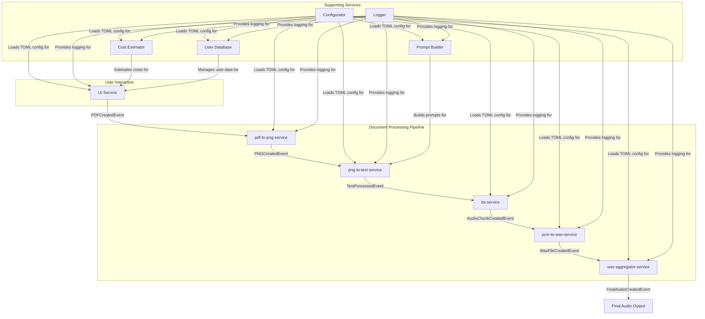
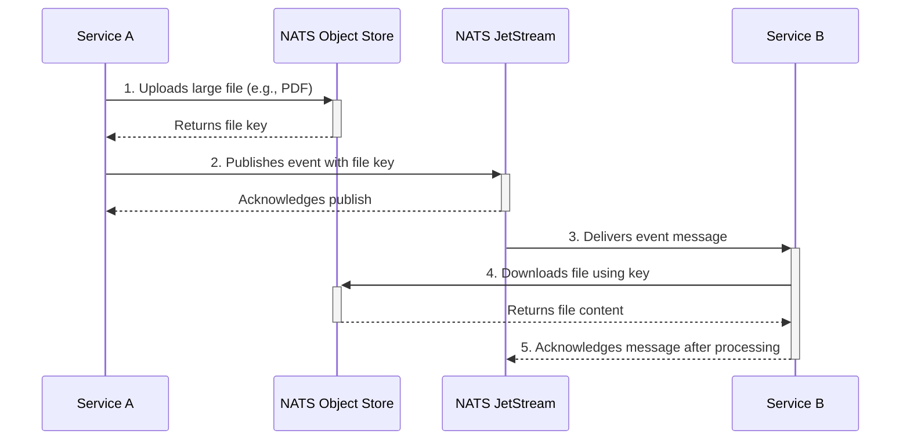

# Book Expert

Book Expert is a distributed, event-driven system that transforms PDF documents into high-quality audiobooks. Built on a microservices architecture, it leverages NATS JetStream for resilient and scalable communication, ensuring a reliable and decoupled workflow from document upload to final audio generation.

## Architecture Overview

The system is designed as a pipeline of specialized microservices, each responsible for a single stage of the transformation process. Services communicate asynchronously by publishing and subscribing to events on NATS JetStream subjects. This decoupled approach allows for independent scaling, development, and deployment of each component.

Large binary data, such as PDFs, images, and audio files, are stored in NATS Object Stores. Event messages contain lightweight references (keys) to these objects, keeping the event payloads small and efficient. Each service follows a consistent bootstrapping pattern: load configuration, set up logging, connect to NATS, programmatically ensure all required JetStream resources (streams, consumers, object stores) exist, and then start a worker to process messages.

### NATS Pipeline Flow

The following diagram illustrates the end-to-end workflow, from the initial PDF upload to the final aggregated audio file.

### Core Communication Pattern

The interaction between any two services in the pipeline follows a consistent, decoupled pattern. Instead of sending large data payloads through the messaging system, services store the data in a NATS Object Store and publish a lightweight event containing a key to that data.

This pattern ensures that the messaging layer remains fast and efficient, while still allowing for the processing of large files.

## Services

### Core Pipeline

-   **UI Service**: The web-based entry point for users to upload PDF documents. It stores the PDF in a NATS Object Store and publishes the initial `PDFCreatedEvent` to trigger the pipeline.
-   **pdf-to-png-service**: Subscribes to `PDFCreatedEvent`, downloads the PDF, and converts each page into a high-resolution PNG image using Ghostscript. It publishes a `PNGCreatedEvent` for each generated image.
-   **png-to-text-service**: Subscribes to `PNGCreatedEvent`, performs Optical Character Recognition (OCR) on each PNG image to extract the text, and can optionally apply augmentations like summaries or commentary using a Gemini-based processor. It publishes a `TextProcessedEvent` with the resulting text.
-   **tts-service**: Subscribes to `TextProcessedEvent` and uses a Text-to-Speech (TTS) engine (`chatllm`) to convert the text into raw PCM audio data. It publishes an `AudioChunkCreatedEvent` for each audio segment.
-   **pcm-to-wav-service**: Subscribes to `AudioChunkCreatedEvent`, converts the raw PCM audio into the standardized WAV format using `sox`, and publishes a `WavFileCreatedEvent`.
-   **wav-aggregator-service**: Subscribes to `WavFileCreatedEvent` and collects all WAV files for a given workflow using a NATS Key-Value store for state tracking. Once all pages have been processed, it combines them into a single audiobook file using `sox` and publishes a `FinalAudioCreatedEvent`.

### Supporting Services

-   **Configurator**: A centralized library that loads configuration from a shared `project.toml` file, providing consistent settings to all services.
-   **Logger**: A standardized logging utility used by all services to ensure consistent and structured log output.
-   **Cost Estimator Service**: Provides cost estimations for document processing based on page count and selected augmentations.
-   **User Database Service**: Manages user accounts, tenants, and authentication against a PostgreSQL database.
-   **Prompt Builder**: A tool for constructing detailed and structured prompts for AI-driven text augmentation.
-   **Events**: A shared library defining the canonical event structures (`PDFCreatedEvent`, `PNGCreatedEvent`, etc.) used for all inter-service communication.

## Technology Stack

-   **Backend**: Go 1.25
-   **Frontend**: TypeScript, Tailwind CSS
-   **Messaging & Storage**: NATS JetStream (Streams, Object Store, KV Store)
-   **Database**: PostgreSQL (for User Database Service)
-   **Audio Processing**: `sox`
-   **PDF Processing**: Ghostscript
-   **Text-to-Speech**: `chatllm`
-   **OCR**: Tesseract

## Getting Started

Each service is a standalone Go application that can be built and run independently.

1.  **Prerequisites**:
    -   Go 1.25 or later
    -   A running NATS Server with JetStream enabled
    -   External CLI tools as required by each service (e.g., `sox`, `gs`, `tesseract`, `chatllm`).
2.  **Configuration**:
    -   A central `project.toml` file, accessible via a URL, is used to configure all services. The `PROJECT_TOML` environment variable must be set to this URL for each service.
3.  **Building and Running**:
    -   Navigate to the directory of the service you want to run (e.g., `cd pdf-to-png-service`).
    -   Build the service using `make build`.
    -   Run the service binary (e.g., `./bin/pdf-to-png-service`), ensuring the `PROJECT_TOML` environment variable is set.

For detailed instructions, refer to the `README.md` file within each service's directory.
